# CameLog – Desert Oasis Care 🌵

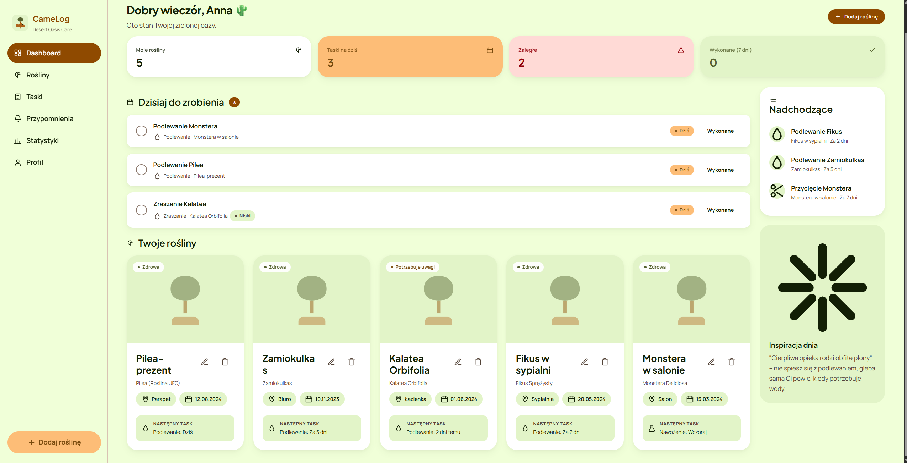

Aplikacja PWA do zarządzania domową kolekcją roślin: rejestrowanie roślin, planowanie pielęgnacji, przypomnienia, statystyki i panel administratora. Stos: **vanilla PHP (REST) + MySQL/MariaDB + waniliowy JS (SPA + Service Worker)**, bez frameworków backendowych ani frontendowych.

> Tematyka wizualna: **Warm Desert Botanical** — terakota, leśna zieleń, ciepłe szałwiowe tonacje. Logo: wielbłąd-pielęgniarz pod drzewem.

---

## Spis treści

1. [Funkcjonalności](#funkcjonalności)
2. [Stos technologiczny](#stos-technologiczny)
3. [Wymagania](#wymagania)
4. [Instalacja lokalna](#instalacja-lokalna)
5. [Konfiguracja .env](#konfiguracja-env)
6. [Konto testowe](#konto-testowe)
7. [Struktura katalogów](#struktura-katalogów)
8. [Endpointy REST API](#endpointy-rest-api)
9. [Integracja z Perenual API](#integracja-z-perenual-api)
10. [PWA i tryb offline](#pwa-i-tryb-offline)
11. [Docker](#docker)
12. [Co jest poza MVP](#co-jest-poza-mvp)

---

## Funkcjonalności

- **Rejestracja, logowanie, profil użytkownika** (sesyjne, hasła `password_hash`).
- **Rośliny** – lista, filtrowanie, dodawanie z fotografią, edycja, usuwanie.
- **Wyszukiwanie gatunków** przez Perenual API (server-side; klucz zostaje na backendzie).
  - Panel z zaleceniami: nazwa zwyczajowa, naukowa, podlewanie, nasłonecznienie, poziom trudności, opis.
  - Dwa przyciski: **„Użyj zaleceń”** (auto-uzupełnia harmonogram) / **„Dostosuj ręcznie”** (zachowuje gatunek, nie nadpisuje).
  - Tryb **mock** gdy brak klucza – aplikacja działa w pełni do prezentacji.
- **Taski** – planowanie pielęgnacji (podlewanie, nawożenie, przycinanie, przesadzanie, zraszanie, inne), powtarzalne, priorytety, statusy `pending/done/skipped`.
- **Historia pielęgnacji** – każde wykonane zadanie zapisuje wpis (auto przy „wykonano”, można dodać ręcznie szybko).
- **Przypomnienia** – generowane z otwartych tasków: dziś / nadchodzące / zaległe / systemowe.
- **Statystyki** – liczba akcji w 30 dniach, podział po typach, top roślina, dzienna aktywność (linia + wypełnienie).
- **Panel administratora** – lista użytkowników, blokowanie / odblokowywanie / usuwanie, statystyki konta.
- **PWA** – manifest, ikony, Service Worker (cache-first dla statyki, network-first dla `/api`), strona offline `/offline.html`.

## Stos technologiczny

| Warstwa     | Technologie                                      |
| ----------- | ------------------------------------------------ |
| Backend     | PHP 8.1+, PDO, sesje, prosty router REST         |
| Baza danych | MySQL 8.0 / MariaDB 10.5+                        |
| Frontend    | HTML5 + CSS3 (Design tokens) + waniliowy JS (SPA, History API), Google Fonts |
| PWA         | manifest.json, service-worker.js                 |
| Konteneryzacja | Docker + docker-compose (opcjonalnie)         |

Brak: Laravel/Symfony, brak Reacta/Vue, brak buildowania frontu (no Webpack/Vite).

## Wymagania

- PHP 8.1+ z modułami `pdo_mysql`, `mbstring`, `curl`, `gd` (do uploadu zdjęć).
- MySQL 8 lub MariaDB 10.5+.
- Apache z `mod_rewrite` (lub odpowiednik – patrz sekcja „Inne serwery WWW”).
- (Opcjonalnie) konto Perenual i klucz API: <https://perenual.com/docs/api>.

## Instalacja lokalna

```bash
# 1. Klon
git clone <repo> camelog-app && cd camelog-app

# 2. Konfiguracja .env
cp .env.example .env
# zaktualizuj DB_*, ustaw PERENUAL_API_KEY (opcjonalnie)

# 3. Baza
mysql -u root -p -e "CREATE DATABASE camelog DEFAULT CHARACTER SET utf8mb4 COLLATE utf8mb4_unicode_ci;"
mysql -u root -p camelog < database/schema.sql
mysql -u root -p camelog < database/seed.sql

# 4. Uruchomienie wbudowanym serwerem PHP (development)
php -S localhost:8080 -t public

# 5. Otwórz http://localhost:8080
```

### Inne serwery WWW

- **Apache** – DocumentRoot powinien wskazywać na `public/`. Plik `.htaccess` jest dołączony.
- **Nginx** – przykładowy fragment:
  ```nginx
  root /var/www/camelog/public;
  index index.php;
  location / { try_files $uri $uri/ /index.php?$query_string; }
  location ~ \.php$ { fastcgi_pass unix:/run/php/php-fpm.sock; include fastcgi_params; fastcgi_param SCRIPT_FILENAME $realpath_root$fastcgi_script_name; }
  ```

### Uprawnienia katalogów

```bash
chmod -R 775 public/uploads storage
```

## Konfiguracja .env

```dotenv
# Aplikacja
APP_DEBUG=true
APP_URL=http://localhost:8080
SESSION_NAME=CAMELOG_SID

# Baza
DB_HOST=127.0.0.1
DB_PORT=3306
DB_NAME=camelog
DB_USER=root
DB_PASS=

# Perenual API – jeśli puste, używamy mocka
PERENUAL_API_KEY=

# Upload
UPLOAD_MAX_SIZE=5242880
```

**Uwaga**: `PERENUAL_API_KEY` jest używany **wyłącznie po stronie backendu** (`app/Services/SpeciesApiService.php`) – frontend nigdy nie zna tego klucza.

## Konto testowe

Po imporcie `seed.sql`:

| Rola  | Email              | Hasło     |
| ----- | ------------------ | --------- |
| Admin | admin@camelog.pl   | admin123  |
| User  | user@camelog.pl    | user123   |
| User  | marek@camelog.pl   | user123   |
| User (zablokowany) | ewa@camelog.pl | user123 |

Konto `user@camelog.pl` ma 5 przykładowych roślin oraz mix tasków zaległych / dziś / nadchodzących / wykonanych.

## Struktura katalogów

```
camelog-app/
├── app/
│   ├── Controllers/        # AuthController, PlantController, TaskController, …
│   ├── Core/               # Database, Router, Request, Response, Auth, Validator
│   ├── Middleware/         # AuthMiddleware, AdminMiddleware
│   ├── Models/             # User, Plant, Species, CareTask, CareHistory, Notification
│   ├── Repositories/       # *Repository (PDO prepared statements)
│   ├── Services/           # AuthService, PlantService, TaskService, ReminderService, StatsService, FileUploadService, SpeciesApiService
│   └── config/
│       ├── config.php      # ładowanie .env, struktura konfiguracji
│       └── routes.php      # rejestracja tras REST
├── database/
│   ├── schema.sql          # CREATE TABLE
│   └── seed.sql            # dane startowe
├── docs/
│   ├── api-endpoints.md
│   └── architecture.md
├── public/                 # DOCUMENT ROOT serwera
│   ├── index.php           # Front Controller (REST + SPA)
│   ├── index.html          # SPA shell
│   ├── manifest.json       # PWA manifest
│   ├── service-worker.js   # SW (cache-first/network-first)
│   ├── offline.html        # tryb offline
│   ├── .htaccess
│   ├── assets/
│   │   ├── css/app.css
│   │   ├── js/             # api, ui, auth, router, species, plants, plant-form, tasks, notifications, stats, admin, app
│   │   └── images/         # logo.svg, ikony PWA, placeholder
│   └── uploads/plants/     # uploady zdjęć (zapis przez backend)
├── storage/
│   ├── cache/
│   └── logs/
├── docker/                 # Dockerfile, php.ini
├── docker-compose.yml
├── .env.example
└── README.md
```

## Endpointy REST API

Pełna lista w [`docs/api-endpoints.md`](docs/api-endpoints.md). Skrót:

- **Auth**: `POST /api/auth/{register,login,logout}`, `GET /api/auth/me`, `PATCH /api/auth/{profile,password}`
- **Plants**: `GET/POST /api/plants`, `GET/PUT/DELETE /api/plants/{id}`, `POST /api/plants/{id}/photo`, `GET /api/plants/{id}/stats`
- **Species** (Perenual): `GET /api/species/search?query=…`, `GET /api/species/{id}`, `POST /api/species/import`
- **Tasks**: `GET /api/tasks` (+`?type=…&status=…&plant_id=…&due=today|incoming|overdue`), `POST /api/tasks`, `PATCH /api/tasks/{id}/{complete|skip}`, `DELETE /api/tasks/{id}`
- **Plant tasks/history**: `GET/POST /api/plants/{plantId}/tasks`, `GET/POST /api/plants/{plantId}/history`
- **Notifications**: `GET /api/notifications`, `PATCH /api/notifications/{id}/read`, `PATCH /api/notifications/read-all`
- **Stats**: `GET /api/stats/overview`
- **Admin**: `GET /api/admin/users`, `PATCH /api/admin/users/{id}/{block|unblock}`, `DELETE /api/admin/users/{id}`

## Integracja z Perenual API

- Endpointy: `/api/species/search?query=...` i `/api/species/{external_id}` po stronie backendu opakowują `https://perenual.com/api/species-list` oraz `/species/details/...`.
- Klucz `PERENUAL_API_KEY` jest dodawany jako parametr `key` na backendzie.
- Brak klucza → backend zwraca `source: "mock"` z 7 popularnymi gatunkami; aplikacja działa w pełni.
- Frontend **nigdy** nie wywołuje Perenual bezpośrednio.

W formularzu „Dodaj roślinę”:

1. Użytkownik zaczyna wpisywać nazwę → autocompletion przez `/api/species/search`.
2. Wybór elementu → `/api/species/{external_id}` zwraca szczegóły.
3. Pojawia się **panel z zaleceniami** + tekst pomocniczy *„To są zalecenia pobrane z zewnętrznej bazy gatunków. Możesz dostosować harmonogram pielęgnacji ręcznie.”*
4. Przycisk „Użyj zaleceń” → automatycznie ustawia `watering_interval_days`, `fertilizing_interval_days`, `care_level`. `api_recommendations_used = true`.
5. Przycisk „Dostosuj ręcznie” → zachowuje wybór gatunku ale **nie nadpisuje** pól; `api_recommendations_used = false`.
6. Po zapisie roślina ma `species_id` (kopia w lokalnej tabeli `species`) + ewentualnie zmodyfikowane pola.

## PWA i tryb offline

- `manifest.json` z ikonami (72–512), kolorystyka motywu `#8f4a00`, shortcuts „Dodaj roślinę” i „Taski na dziś”.
- `service-worker.js`:
  - `install` → cache statycznych assetów,
  - `activate` → czyszczenie starych cache,
  - `fetch` → cache-first dla statyki, network-first dla `/api/*`, fallback `/offline.html` przy nawigacji bez sieci.
- `/offline.html` – samodzielnie ostylowany ekran, automatyczny reload po wznowieniu połączenia.

## Docker

```bash
docker compose up --build
# aplikacja na http://localhost:8080
# MariaDB na localhost:3307 (user: camelog, pass: camelog)
```

`docker-compose.yml` uruchamia: PHP+Apache (`docker/Dockerfile`), MariaDB (z auto-importem `schema.sql` + `seed.sql` z folderu `database/`).

## Co jest poza MVP

- 🚫 Sensory IoT (temperatura, wilgotność powietrza/gleby) – zaplanowane jako rozszerzenie.
- 🚫 Powiadomienia push (web push) – obecnie tylko in-app i mockowy badge.
- 🚫 Wysyłka e-maili (przypomnienia mailem) – poza MVP.
- 🚫 Pełnoekranowe wykresy temperatury / wilgotności – nie ma takich danych w MVP.
- 🚫 Logowanie OAuth (Google/GitHub) – poza MVP.
- 🚫 Pełnoekranowe API GraphQL – jest tylko REST.

---
- **PWA** – manifest, ikony, Service Worker (cache-first dla statyki, network-first dla `/api`), strona offline `/offline.html`.

## Stos technologiczny

| Warstwa     | Technologie                                      |
| ----------- | ------------------------------------------------ |
| Backend     | PHP 8.1+, PDO, sesje, prosty router REST         |
| Baza danych | MySQL 8.0 / MariaDB 10.5+                        |
| Frontend    | HTML5 + CSS3 (Design tokens) + waniliowy JS (SPA, History API), Google Fonts |
| PWA         | manifest.json, service-worker.js                 |
| Konteneryzacja | Docker + docker-compose (opcjonalnie)         |

Brak: Laravel/Symfony, brak Reacta/Vue, brak buildowania frontu (no Webpack/Vite).

## Wymagania

- PHP 8.1+ z modułami `pdo_mysql`, `mbstring`, `curl`, `gd` (do uploadu zdjęć).
- MySQL 8 lub MariaDB 10.5+.
- Apache z `mod_rewrite` (lub odpowiednik – patrz sekcja „Inne serwery WWW”).
- (Opcjonalnie) konto Perenual i klucz API: <https://perenual.com/docs/api>.

## Instalacja lokalna

```bash
# 1. Klon
git clone <repo> camelog-app && cd camelog-app

# 2. Konfiguracja .env
cp .env.example .env
# zaktualizuj DB_*, ustaw PERENUAL_API_KEY (opcjonalnie)

# 3. Baza
mysql -u root -p -e "CREATE DATABASE camelog DEFAULT CHARACTER SET utf8mb4 COLLATE utf8mb4_unicode_ci;"
mysql -u root -p camelog < database/schema.sql
mysql -u root -p camelog < database/seed.sql

# 4. Uruchomienie wbudowanym serwerem PHP (development)
php -S localhost:8080 -t public

# 5. Otwórz http://localhost:8080
```

### Inne serwery WWW

- **Apache** – DocumentRoot powinien wskazywać na `public/`. Plik `.htaccess` jest dołączony.
- **Nginx** – przykładowy fragment:
  ```nginx
  root /var/www/camelog/public;
  index index.php;
  location / { try_files $uri $uri/ /index.php?$query_string; }
  location ~ \.php$ { fastcgi_pass unix:/run/php/php-fpm.sock; include fastcgi_params; fastcgi_param SCRIPT_FILENAME $realpath_root$fastcgi_script_name; }
  ```

### Uprawnienia katalogów

```bash
chmod -R 775 public/uploads storage
```

## Konfiguracja .env

```dotenv
# Aplikacja
APP_DEBUG=true
APP_URL=http://localhost:8080
SESSION_NAME=CAMELOG_SID

# Baza
DB_HOST=127.0.0.1
DB_PORT=3306
DB_NAME=camelog
DB_USER=root
DB_PASS=

# Perenual API – jeśli puste, używamy mocka
PERENUAL_API_KEY=

# Upload
UPLOAD_MAX_SIZE=5242880
```

**Uwaga**: `PERENUAL_API_KEY` jest używany **wyłącznie po stronie backendu** (`app/Services/SpeciesApiService.php`) – frontend nigdy nie zna tego klucza.

## Konto testowe

Po imporcie `seed.sql`:

| Rola  | Email              | Hasło     |
| ----- | ------------------ | --------- |
| Admin | admin@camelog.pl   | admin123  |
| User  | user@camelog.pl    | user123   |
| User  | marek@camelog.pl   | user123   |
| User (zablokowany) | ewa@camelog.pl | user123 |

Konto `user@camelog.pl` ma 5 przykładowych roślin oraz mix tasków zaległych / dziś / nadchodzących / wykonanych.

## Struktura katalogów

```
camelog-app/
├── app/
│   ├── Controllers/        # AuthController, PlantController, TaskController, …
│   ├── Core/               # Database, Router, Request, Response, Auth, Validator
│   ├── Middleware/         # AuthMiddleware, AdminMiddleware
│   ├── Models/             # User, Plant, Species, CareTask, CareHistory, Notification
│   ├── Repositories/       # *Repository (PDO prepared statements)
│   ├── Services/           # AuthService, PlantService, TaskService, ReminderService, StatsService, FileUploadService, SpeciesApiService
│   └── config/
│       ├── config.php      # ładowanie .env, struktura konfiguracji
│       └── routes.php      # rejestracja tras REST
├── database/
│   ├── schema.sql          # CREATE TABLE
│   └── seed.sql            # dane startowe
├── docs/
│   ├── api-endpoints.md
│   └── architecture.md
├── public/                 # DOCUMENT ROOT serwera
│   ├── index.php           # Front Controller (REST + SPA)
│   ├── index.html          # SPA shell
│   ├── manifest.json       # PWA manifest
│   ├── service-worker.js   # SW (cache-first/network-first)
│   ├── offline.html        # tryb offline
│   ├── .htaccess
│   ├── assets/
│   │   ├── css/app.css
│   │   ├── js/             # api, ui, auth, router, species, plants, plant-form, tasks, notifications, stats, admin, app
│   │   └── images/         # logo.svg, ikony PWA, placeholder
│   └── uploads/plants/     # uploady zdjęć (zapis przez backend)
├── storage/
│   ├── cache/
│   └── logs/
├── docker/                 # Dockerfile, php.ini
├── docker-compose.yml
├── .env.example
└── README.md
```

## Endpointy REST API

Pełna lista w [`docs/api-endpoints.md`](docs/api-endpoints.md). Skrót:

- **Auth**: `POST /api/auth/{register,login,logout}`, `GET /api/auth/me`, `PATCH /api/auth/{profile,password}`
- **Plants**: `GET/POST /api/plants`, `GET/PUT/DELETE /api/plants/{id}`, `POST /api/plants/{id}/photo`, `GET /api/plants/{id}/stats`
- **Species** (Perenual): `GET /api/species/search?query=…`, `GET /api/species/{id}`, `POST /api/species/import`
- **Tasks**: `GET /api/tasks` (+`?type=…&status=…&plant_id=…&due=today|incoming|overdue`), `POST /api/tasks`, `PATCH /api/tasks/{id}/{complete|skip}`, `DELETE /api/tasks/{id}`
- **Plant tasks/history**: `GET/POST /api/plants/{plantId}/tasks`, `GET/POST /api/plants/{plantId}/history`
- **Notifications**: `GET /api/notifications`, `PATCH /api/notifications/{id}/read`, `PATCH /api/notifications/read-all`
- **Stats**: `GET /api/stats/overview`
- **Admin**: `GET /api/admin/users`, `PATCH /api/admin/users/{id}/{block|unblock}`, `DELETE /api/admin/users/{id}`

## Integracja z Perenual API

- Endpointy: `/api/species/search?query=...` i `/api/species/{external_id}` po stronie backendu opakowują `https://perenual.com/api/species-list` oraz `/species/details/...`.
- Klucz `PERENUAL_API_KEY` jest dodawany jako parametr `key` na backendzie.
- Brak klucza → backend zwraca `source: "mock"` z 7 popularnymi gatunkami; aplikacja działa w pełni.
- Frontend **nigdy** nie wywołuje Perenual bezpośrednio.

W formularzu „Dodaj roślinę”:

1. Użytkownik zaczyna wpisywać nazwę → autocompletion przez `/api/species/search`.
2. Wybór elementu → `/api/species/{external_id}` zwraca szczegóły.
3. Pojawia się **panel z zaleceniami** + tekst pomocniczy *„To są zalecenia pobrane z zewnętrznej bazy gatunków. Możesz dostosować harmonogram pielęgnacji ręcznie.”*
4. Przycisk „Użyj zaleceń” → automatycznie ustawia `watering_interval_days`, `fertilizing_interval_days`, `care_level`. `api_recommendations_used = true`.
5. Przycisk „Dostosuj ręcznie” → zachowuje wybór gatunku ale **nie nadpisuje** pól; `api_recommendations_used = false`.
6. Po zapisie roślina ma `species_id` (kopia w lokalnej tabeli `species`) + ewentualnie zmodyfikowane pola.

## PWA i tryb offline

- `manifest.json` z ikonami (72–512), kolorystyka motywu `#8f4a00`, shortcuts „Dodaj roślinę” i „Taski na dziś”.
- `service-worker.js`:
  - `install` → cache statycznych assetów,
  - `activate` → czyszczenie starych cache,
  - `fetch` → cache-first dla statyki, network-first dla `/api/*`, fallback `/offline.html` przy nawigacji bez sieci.
- `/offline.html` – samodzielnie ostylowany ekran, automatyczny reload po wznowieniu połączenia.

## Docker

```bash
docker compose up --build
# aplikacja na http://localhost:8080
# MariaDB na localhost:3307 (user: camelog, pass: camelog)
```

`docker-compose.yml` uruchamia: PHP+Apache (`docker/Dockerfile`), MariaDB (z auto-importem `schema.sql` + `seed.sql` z folderu `database/`).

## Co jest poza MVP

- 🚫 Sensory IoT (temperatura, wilgotność powietrza/gleby) – zaplanowane jako rozszerzenie.
- 🚫 Powiadomienia push (web push) – obecnie tylko in-app i mockowy badge.
- 🚫 Wysyłka e-maili (przypomnienia mailem) – poza MVP.
- 🚫 Pełnoekranowe wykresy temperatury / wilgotności – nie ma takich danych w MVP.
- 🚫 Logowanie OAuth (Google/GitHub) – poza MVP.
- 🚫 Pełnoekranowe API GraphQL – jest tylko REST.

---

🌱 **Powodzenia z opieką nad twoją zieloną oazą!**

---

## Galeria

<table>
  <tr>
    <td align="center">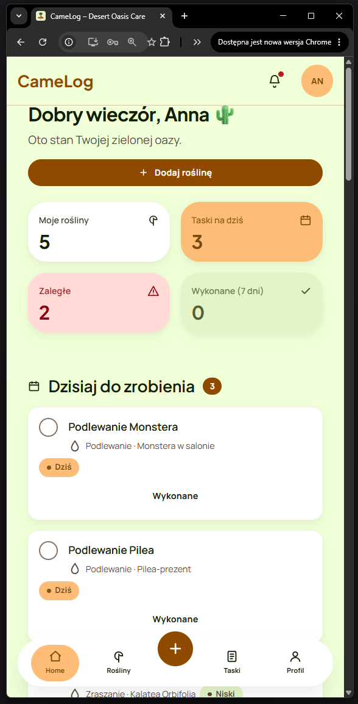<br/><b>Dashboard (Mobile)</b></td>
    <td align="center">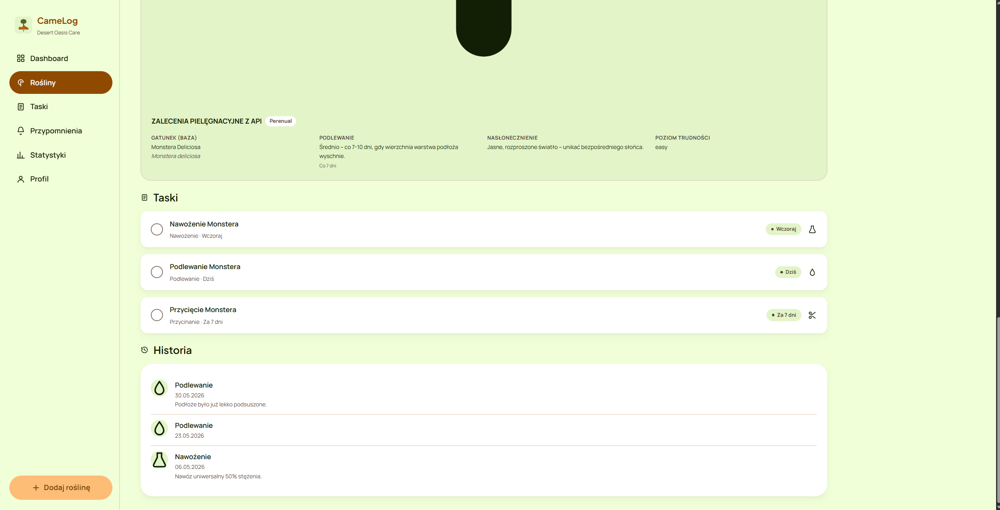<br/><b>Szczegóły rośliny</b></td>
    <td align="center">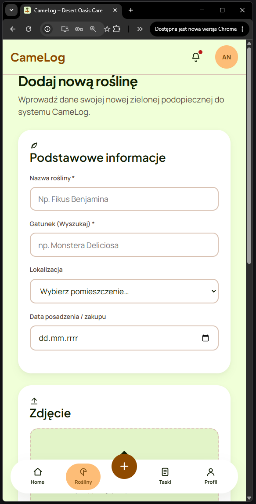<br/><b>Dodawanie (Mobile)</b></td>
  </tr>
  <tr>
    <td align="center">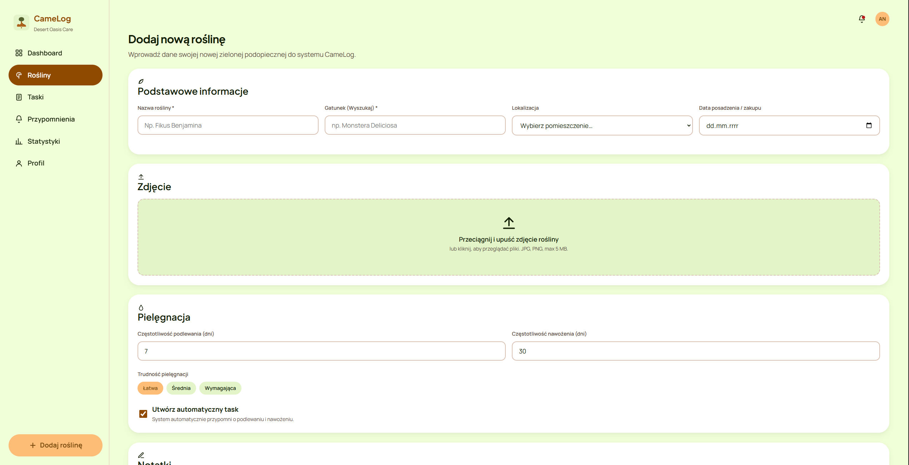<br/><b>Panel Roślin</b></td>
    <td align="center">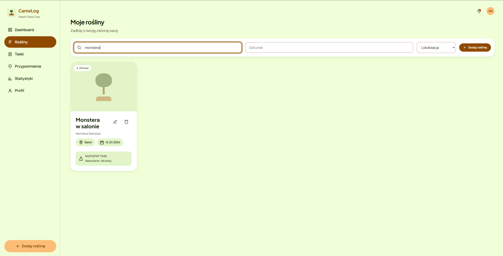<br/><b>Rośliny (Sortowane)</b></td>
    <td align="center"><br/><b>Rośliny (Mobile)</b></td>
  </tr>
  <tr>
    <td align="center">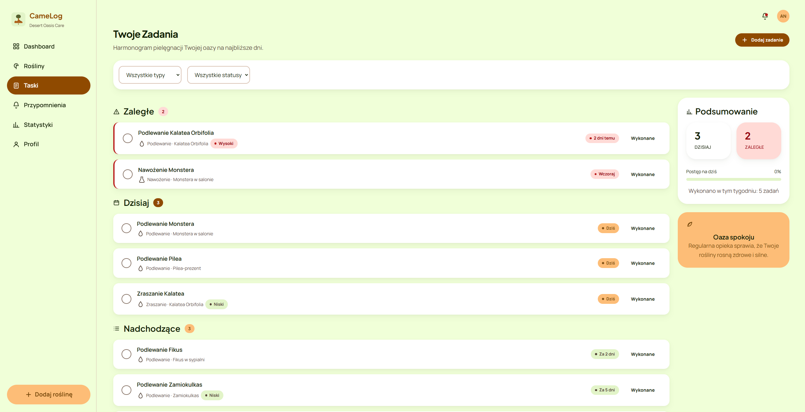<br/><b>Lista zadań</b></td>
    <td align="center">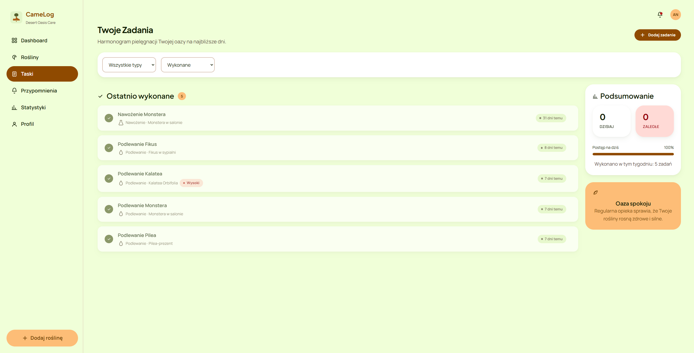<br/><b>Zakończone zadania</b></td>
    <td align="center">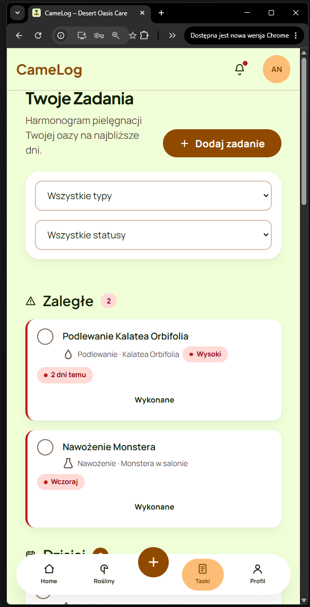<br/><b>Zadania (Mobile)</b></td>
  </tr>
  <tr>
    <td align="center">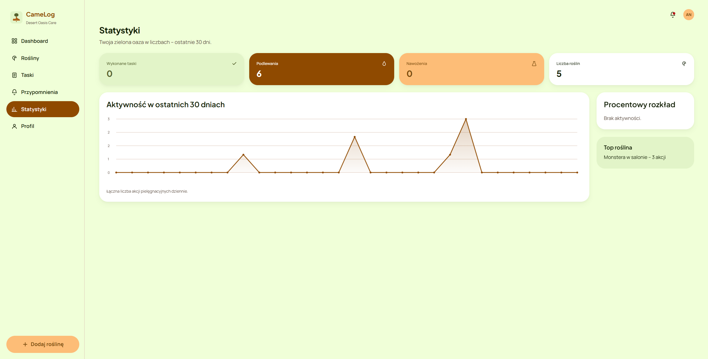<br/><b>Statystyki</b></td>
    <td align="center">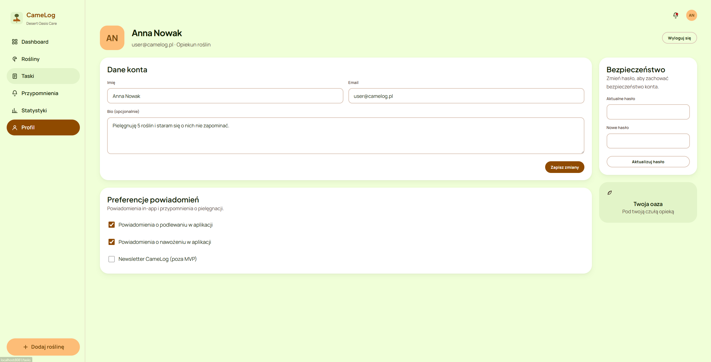<br/><b>Profil Użytkownika</b></td>
    <td align="center">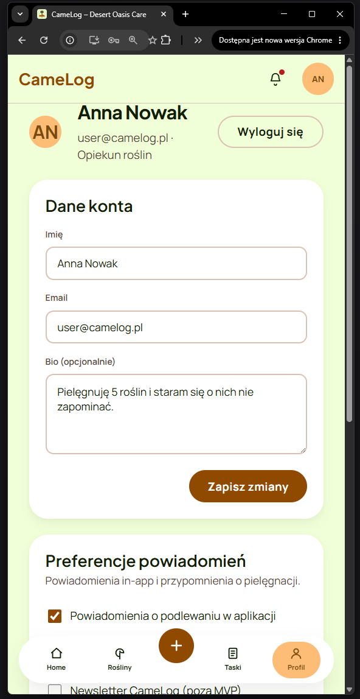<br/><b>Profil (Mobile)</b></td>
  </tr>
</table>
